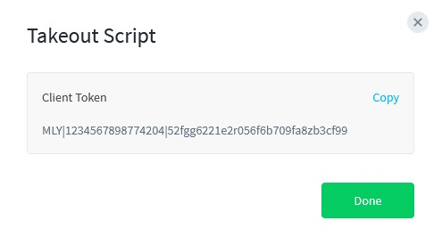

# Pipeline for Automated Dataset Preparation and Model Training

This repository contains an automated workflow for downloading, labeling, preparing, and training a YOLO11 model on traffic sign detection.
Key features:

* Automated data acquisition from Mapillary based on provided coordinates or sequences

* Automatic dataset preparation with LabelMe-compatible annotations

* Conversion to YOLO format and dataset structuring

* Model training and saving for further integration

* Ready-to-use pipelines for reproducible processing

### Installation

1. (Optional) Create virtual environment:\
python -m venv .venv
2. Install dependencies:\
pip install -r requirements.txt
3. Install PyTorch with CUDA 12.6 support:\
pip install torch torchvision torchaudio --index-url https://download.pytorch.org/whl/cu126

### Usage

1. Edit your MAPILLARY_TOKEN in .env file\
"downloader/.env"
2. Paste coordinates and sequences into .txt files\
"downloader/download_by_area/coordinates.txt"\
"downloader/download_by_area/sequences.txt"\
<images for a user to show him viable formats>
3. (Optional) Download my model from huggingface (not yey)
4. Run pipelines/pipeline_prepare_data.py
5. Verify the labels using e.g. Labelme
6. Run pipelines/pipeline_finalize_dataset.py

### Read carefully, what pipelines do!

## How to get your access token
 - Go to https://www.mapillary.com/dashboard/developers
 - Click on "Registrer Application", enter the needed informations, enable the application to "Read" data, then click on register :

    
 - When this registration is done, click on "view" in the token column. This is you access token : 

    
