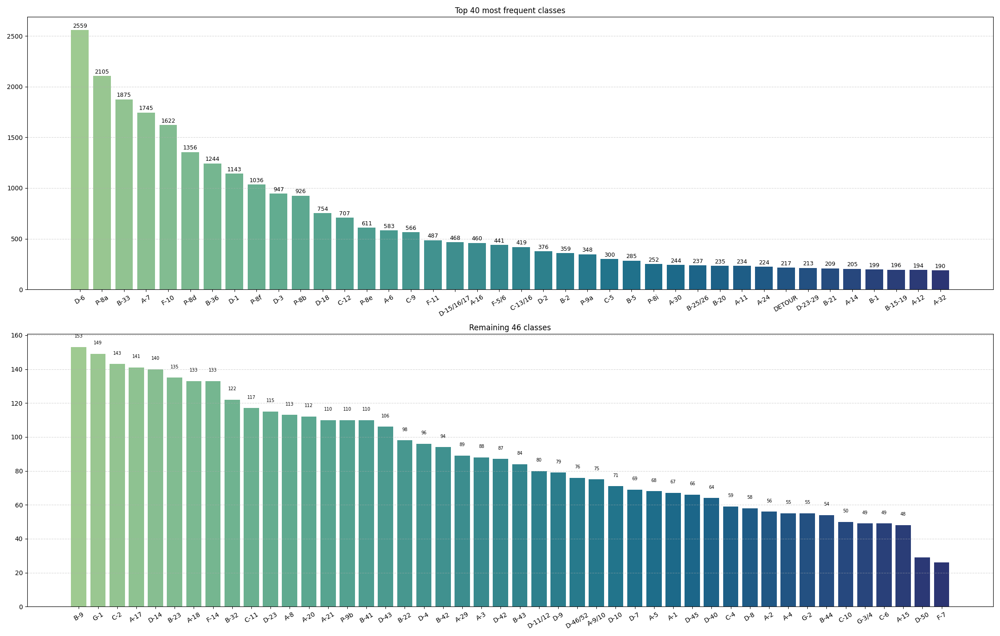
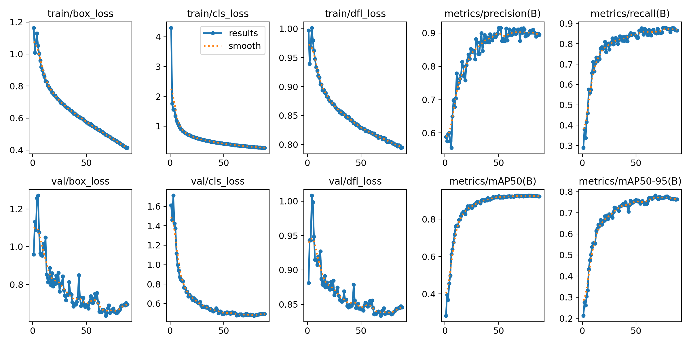

# Traffic Sign Detection

This module contains scripts for downloading, processing, and training
a custom YOLO11 model for traffic sign detection using imagery from
Mapillary.\
It also supports experiment tracking with MLflow.

## 👤 Who is this for?

- Just want to use the app? You don't need this folder. The pretrained model is enough.

- Want to retrain the model or use custom data? Follow the steps below.

## 📦 Technologies Used
- Python 3.12
- PyTorch (CUDA 12.6)
- Labelme
- Albumentations
- Ultralytics YOLO11
- MLflow

> [!NOTE]
> This workflow was tested with Python 3.12 only

## 🗂️ Folder Structure
```
Model/
├── downloader/            # Mapillary data downloading
├── pipelines/             # Pipeline for preprocessing and dataset structuring
├── preprocessing/         # Additional transformation tools
├── training/              # Training scripts YOLO
├── utils/                 # Helper functions
├── README.md              # You are reading it
├── prediction_pytorch.py  # A script to detect traffic signs on a video
└── requirements.txt       # Python dependencies
```

## 🧪 Training Pipeline – Step by Step

1. Set up your environment
```bash
python -m venv .venv
.venv\Scripts\activate  # on Windows
pip install -r requirements.txt
pip install torch torchvision torchaudio --index-url https://download.pytorch.org/whl/cu126
```

2. Get a Mapillary token
- Visit [Mapillary Developers](https://www.mapillary.com/dashboard/developers)
- Register your application and allow "READ" access
- Copy your API token and place it in [`.env`](downloader/.env):
```
MAPILLARY_TOKEN=MLY|YOUR|TOKEN #set your token here
```

<details><summary>📸 Click to show Mapillary screenshots</summary>

<br>


</details>


3. Add data sources

- Add coordinates to: [`coordinates.txt`](downloader/download_by_area/coordinates.txt)
- Add sequence IDs to: [`sequences.txt`](downloader/download_by_area/sequences.txt)

4. Prepare the dataset 
```bash
python pipelines/prepare_data.py
```

5. Manually verify labels
Use [Labelme](https://github.com/wkentaro/labelme) to check/adjust bounding boxes.


6. Finalize the dataset
```bash
python pipelines/finalize_dataset.py
```

7. Augmentation
```bash
python preprocessing/split_aug_dataset.py
```

8. Train the model (You can enter your own parameters)
```bash
python training/train.py
```

> [!NOTE]  
> Training logs (metrics, artifacts) are saved to MLflow automatically if MLflow is installed and enabled in `train.py`.


9. Export the model (optional)
```bash
yolo export model=best.pt format=onnx
```

## 📂 Detailed description of the workflow

Mapillary is the site which you can download from and upload to cameos from a dash-camera.

This workflow allows you to download images either from the area (default = 0.005 geographical degrees)
or sequences (car routes).

### To download and label the images I created this pipeline:

[`prepare_data.py`](pipelines/prepare_data.py)

The pipeline leaves only labeled images and deletes the rest.\
It creates a new folder `dataset_prepared/` with all the images and labels in json format.

Your next step should be manually verifying the labels, because they are made by the pretrained model.

> [!IMPORTANT]
> How do you that?\
> Use [Labelme](https://github.com/wkentaro/labelme)

When everything is verified, you can go to the next step.

### To prepare the data in YOLO format use this pipeline:

[`finalize_dataset.py`](pipelines/finalize_dataset.py)

After running [`finalize_dataset.py`](pipelines/finalize_dataset.py),
the dataset is stored in a YOLO-compatible format and structure:

```
dataset/
├── images/
│   ├──1.jpg
│   ├──2.jpg
│   ├──3.jpg
│   ...
│
└── labels/
    ├──1.txt
    ├──2.txt
    ├──3.txt
    ...
```

### The last step before training your model is splitting it between sets (training, validation and test) and augmenting the training set

[`split_aug_dataset.py`](preprocessing/split_aug_dataset.py)

The dataset is automatically split into training, validation and training sets (70/20/10 split by default).
You can adjust this ratio in the split script.

I intentionally disabled YOLO11's built-in augmentations (like flipLR and mosaic)
to maintain full controlandconsistency of the training data.

Instead, augmentations are applied explicitly using Albumentations in the split_aug_dataset.py script.

This approach improves reproducibility and allows us to preview the dataset after augmentation and before training.
Each transformation is deterministic and configurable, which makes experiments more predictable.

Example augmentation filters (add RandomFog/Shadow/Rain if you like)

```python
from albumentations import (
    Compose, RandomBrightnessContrast,
    GaussianBlur, MotionBlur, OneOf, GaussNoise,
    HueSaturationValue, RandomRain, RandomShadow
)

transform = Compose([
    OneOf([
        MotionBlur(blur_limit=5),
        GaussianBlur(blur_limit=(3, 5)),
    ], p=0.4),

    OneOf([
        RandomRain(slant_range=(-20, 20), drop_length=30, drop_width=15, drop_color=(50, 50, 50), blur_value=30,
                   brightness_coefficient=0.7, rain_type="drizzle"),
        RandomShadow(shadow_roi=(0, 0.66, 1, 1), num_shadows_limit=(2, 3), shadow_dimension=5,
                     shadow_intensity_range=(0.3, 0.6))
    ], p=0.4),
    
    GaussNoise(std_range=(0.05, 0.1), p=0.2),
    RandomBrightnessContrast(brightness_limit=0.3, contrast_limit=0.5, p=0.5),
    HueSaturationValue(hue_shift_limit=10, sat_shift_limit=25, val_shift_limit=20, p=0.4),
])
```

The structure after running [`split_aug_dataset.py`](./preprocessing/split_aug_dataset.py)

```
dataset/
├── images/
├── labels/
├── train/
│   ├── images/
│   └── labels/
├── val/
│   ├── images/
│   └── labels/
└── test/
    ├── images/
    └── labels/
```

> [!TIP]
> When I don't like the augmentation, or I extend the dataset with new labeled images
> I delete only the train, val and test folders. 

### Training using the YOLO11 model

[`train.py`](training/train.py)

Default parameters of training (you can change it freely)

```python
params = {
    "cfg": "custom_args.yaml",
    "data": "data.yaml",
    "epochs": 100,
    "batch": 36,
    "imgsz": 640,
    "patience": 10,
    "device": "cuda",
    "augment": False,
    "project": "runs/detect",
    "name": "exp_yolo_mlflow",
    "exist_ok": False
}
```

> [!WARNING]
> TODO

## 📂 Bonus [utils/](./utils) folder

<details>
    <summary>Click here to see bonus scripts</summary>

### [`count_instances_of_classes.py`](utils/count_instances_of_classes.py)
    
It creates an image like this one from your dataset_prepared



---

### [`decrease_image_resolution.py`](utils/decrease_image_resolution.py)

It's a simple script to visualize the YOLO input resolution.

Just put an image.jpg to utils folder

---

### [`find_labels.py`](utils/find_labels.py)

You can change targeted classes in this line:
```python
targeted_classes = {'A-5'}
```
The script outputs names of jsons with found labels

---

### [`label_rare_classes.py`](utils/label_rare_classes.py)
```python
skip_classes = {"A-7", "B-33", "B-36", "C-9", "D-1", "D-3", "D-6", "D-18", "D-15/16/17"}
```

### [`label_frequent_classes.py`](utils/label_frequent_classes.py)
```python
target_classes = {"A-7", "B-33", "B-36", "C-9", "D-1", "D-3", "D-6", "D-18", "D-15/16/17"}
```

Why do I use both?
> Use `label_rare_classes.py` to skip classes that occur frequently.
> Delete images with no labels.
> Then use `label_frequent_classes.py` to automatize labeling and correct model errors.

</details>


## 📊 Final results with imgsz=640 (pixels) 

| Metric       | Value |
|--------------|-------|
| mAP@0.5      | 0.93  |
| mAP@0.5:0.95 | 0.78  |
| Precision    | 0.91  |
| Recall       | 0.86  |

## Specified results for each class:
[`results_ultimo.txt`](.doc/results_ultimo.txt)

## Training/validation loss and metrics plots



---

Author: [Artur Sierakowski](https://github.com/ArturSierakowski)\
Source repository: [traffic-sign-detection-workflow](https://github.com/ArturSierakowski/traffic-sign-detection-workflow)
