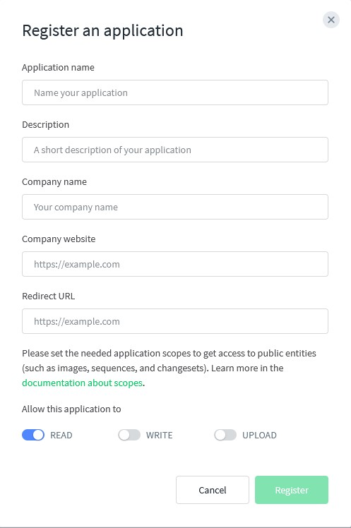

# Traffic Sign Detection

This module contains scripts for downloading, processing, and training
a custom YOLOv11 model for traffic sign detection using imagery from
Mapillary. It also supports experiment tracking with MLflow and exporting
models to ONNX format.

## 👤 Who is this for?

- Just want to use the app? You don't need this folder. The pretrained model is enough.

- Want to retrain the model or use custom data? Follow the steps below.

## 📦 Technologies Used
- Python 3.12
- PyTorch (CUDA 12.6)
- Labelme
- Albumentations
- Ultralytics YOLO11
- MLflow

> [!NOTE]
> This workflow was tested with Python 3.12 only

## 🗂️ Folder Structure
```
Model/
├── downloader/            # Mapillary data downloading
├── pipelines/             # Pipeline for preprocessing and dataset structuring
├── preprocessing/         # Additional transformation tools
├── training/              # Training scripts YOLO
├── utils/                 # Helper functions
└── requirements.txt       # Python dependencies
└── README.md              # You are reading it
```

## 🧪 Training Pipeline – Step by Step

1. Set up your environment
```bash
python -m venv .venv
.venv\Scripts\activate  # on Windows
pip install -r requirements.txt
pip install torch torchvision torchaudio --index-url https://download.pytorch.org/whl/cu126
```

2. Get a Mapillary token
- Visit [Mapillary Developers](https://www.mapillary.com/dashboard/developers)
- Register your application and allow "READ" access
- Copy your API token and place it in `downloader/.env`:
```
MAPILLARY_TOKEN=MLY|YOUR|TOKEN #set your token here
```

<details><summary>📸 Click to show Mapillary screenshots</summary>

<br>




</details>


3. Add data sources

- Add coordinates to: `downloader/download_by_area/coordinates.txt`
- Add sequence IDs to: `downloader/download_by_area/sequences.txt`

4. Prepare the dataset 
```bash
python pipelines/pipeline_prepare_data.py
```

5. Manually verify labels
Use [Labelme](https://github.com/wkentaro/labelme) to check/adjust bounding boxes.

6. Finalize the dataset
```bash
python pipelines/pipeline_finalize_dataset.py
```

7. Augmentation
```bash
python preprocessing/split_aug_dataset.py
```

8. Train the model (enter your own parameters)
```bash
python training/train.py
```

> [!NOTE]  
> Training logs (metrics, artifacts) are saved to MLflow automatically if MLflow is installed and enabled in `train.py`.


9. Export the model (optional)
```bash
yolo export model=best.pt format=onnx
```

## Data and model

<details>
    <summary>Click here to see </summary>

### 🔄 Data Flow Overview
```
downloader scripts (.env + .txt)
     ↓
pipeline_prepare_data.py
     ↓
manual Labelme verification
     ↓
pipeline_finalize_dataset.py
     ↓
yolo train → MLflow → yolo export (ONNX)
```
</details>

## 📊 Wyniki końcowe
| Metryka     | Wartość |
|-------------|---------|
| mAP@0.5     | 0.85    |
| mAP@0.5:0.95| 0.71    |
| Precision   | 0.81    |
| Recall      | 0.80    |

---

Author: [Artur Sierakowski](https://github.com/ArturSierakowski)
Source repository: [traffic-sign-detection-workflow](https://github.com/ArturSierakowski/traffic-sign-detection-workflow)
